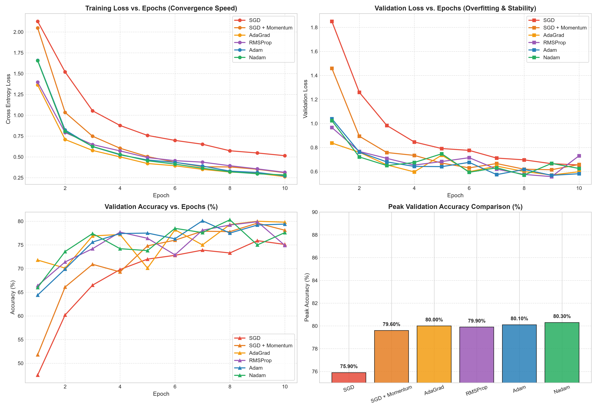
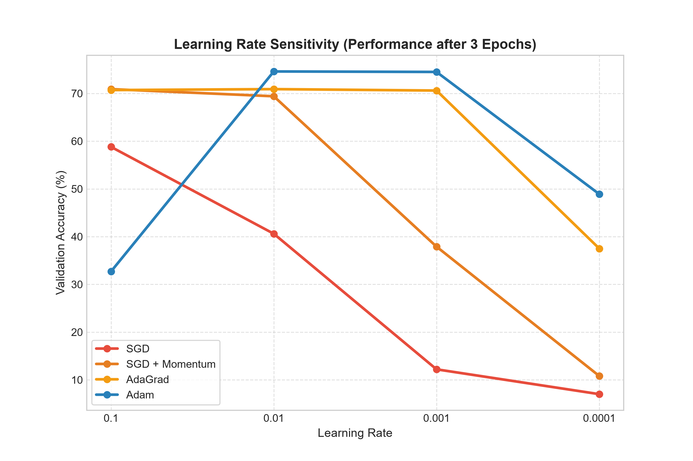

# Deep Dive into Deep Learning Optimizers
### A Comparative Study: SGD, Momentum, AdaGrad, RMSProp, Adam & Nadam

[](https://www.python.org/)
[](https://pytorch.org/)
[](https://opensource.org/licenses/MIT)

> **Prepared for:** Machine Learning Seminar & Presentation  
> **Topic:** Internal Mechanics, Mathematical Formulations, Empirical Benchmarks & Generalization Trade-offs of 6 Core Optimizers.  
> **Target Duration:** 10–15 Minutes (3-Presenter Collaborative Delivery)

---

## 👥 Presenter Roles & Topic Distribution

To ensure equal mastery and seamless delivery, the presentation is divided into three thematic acts:

| Presenter | Assigned Topic Area | Core Mathematical Focus | Analogy / Theme |
| :--- | :--- | :--- | :--- |
| **Person 1** | • Foundations of Optimization<br>• **Standard SGD**<br>• **SGD with Momentum** | • Loss surfaces & gradients<br>• Noisy mini-batch updates: $\theta - \eta g_t$<br>• Velocity accumulator: $v_{t+1} = \gamma v_t + \eta g_t$ | *"The Blind Hiker & The Heavy Bowling Ball: Moving downhill and gaining directional inertia."* |
| **Person 2** | • **AdaGrad**<br>• **RMSProp** | • Cumulative squared gradients: $G_t = \sum g^2$<br>• Vanishing learning rate issue<br>• Leaky exponential moving average: $v_t = \beta v_{t-1} + (1-\beta)g^2$ | *"The Elephant's Memory vs. The Practical Worker: Adapting learning rates to feature frequencies."* |
| **Person 3** | • **Adam**<br>• **Nadam**<br>• The Generalization Mystery | • Unifying 1st ($m_t$) and 2nd ($v_t$) moments<br>• Mathematical Bias Correction: $\frac{1}{1-\beta^t}$<br>• Nesterov lookahead momentum<br>• Flat vs. Sharp minima geometry | *"The Modern Standard: Combining velocity with active suspension, and why fast optimization can hurt generalization."* |
| **All Members** | • **Empirical Benchmark**<br>• **Viva Defense** | • Controlled Fashion-MNIST comparison<br>• Learning rate sensitivity analysis<br>• Teacher cross-examination defense | *"Scientific rigor through identical starting conditions and objective metric evaluation."* |

---

## 📚 Detailed Documentation Hub

All detailed notes, mathematical derivations, experiment guides, and scripts have been compiled in [`docs/`](./docs/):

1. 📓 **[Interactive Jupyter Notebook (`optimizers_deep_dive.ipynb`)](./optimizers_deep_dive.ipynb)**  
   *Complete runnable notebook with student comments, equations, training pipelines, interactive curves, and viva defense.*
2. 📖 **[01. Theory & 12-Point Optimizer Breakdown](./docs/01_theory_and_optimizers.md)**  
   *Foundations from scratch, full 12-point breakdowns for all 6 optimizers, mathematical symbols, and the flat vs. sharp minima debate.*
3. 🔬 **[02. Empirical Benchmark & Experiment Guide](./docs/02_experiment_and_benchmarks.md)**  
   *Code structure of `experiment.py`, fair testing controls, evaluation metrics, and result interpretation.*
4. 🎯 **[03. Application Scenarios & Viva Defense](./docs/03_application_scenarios_and_viva.md)**  
   *4-tier structured answers (Beginner, Technical, Math, 10-Second Viva Punchline) for teacher grilling scenarios.*
5. 🎤 **[04. Presentation Slides & Word-for-Word Scripts](./docs/04_presentation_slides_and_scripts.md)**  
   *Slide-by-slide layout (11 slides), diagram descriptions, and word-for-word scripts for Person 1, Person 2, and Person 3.*

---

## ⚡ Quick Reference: Master Optimizer Comparison

| Optimizer | 1st Moment (Direction) | 2nd Moment (Adaptive Scale) | Update Equation | Primary Advantage | Major Limitation | Best Suited For |
| :--- | :---: | :---: | :--- | :--- | :--- | :--- |
| **SGD** | ❌ None | ❌ None | $\theta_{t+1} = \theta_t - \eta g_t$ | Low memory, simple, unbiased noise escapes shallow minima | Severe oscillations in ravines, stops at saddle points | Simple convex tasks, baseline benchmarks |
| **SGD + Momentum** | ✅ Exponential Average ($\gamma \approx 0.9$) | ❌ None | $v_{t+1} = \gamma v_t + \eta g_t$<br>$\theta_{t+1} = \theta_t - v_{t+1}$ | Cancels oscillations, speeds through ravines & plateaus | Additional hyperparameter to tune, global step size | Computer Vision (ResNets, CNNs), peak test generalization |
| **AdaGrad** | ❌ None | ✅ Cumulative Sum ($G_t = \sum g^2$) | $\theta_{t+1} = \theta_t - \frac{\eta}{\sqrt{G_t + \epsilon}} g_t$ | Larger updates for rare features, no manual tuning required | **Vanishing Learning Rate**: $G_t$ grows forever, freezing learning | Sparse data (Word2Vec, GloVe, recommender click-streams) |
| **RMSProp** | ❌ None | ✅ Leaky Average ($\beta \approx 0.9$) | $v_t = \beta v_{t-1} + (1-\beta)g_t^2$<br>$\theta_{t+1} = \theta_t - \frac{\eta}{\sqrt{v_t + \epsilon}} g_t$ | Solves AdaGrad's dying rate by using recent gradient window | Lacks directional velocity; noisy without momentum | Recurrent Neural Networks (RNNs/LSTMs), Reinforcement Learning |
| **Adam** | ✅ Leaky Average ($\beta_1 \approx 0.9$) | ✅ Leaky Average ($\beta_2 \approx 0.999$) | $\theta_{t+1} = \theta_t - \frac{\eta}{\sqrt{\hat{v}_t} + \epsilon} \hat{m}_t$<br>*(with bias corrections $\hat{m}, \hat{v}$)* | Fast early convergence, robust defaults, works out-of-the-box | Higher memory ($2$ extra states/param), can settle in sharp minima | Transformers, LLMs, GANs, rapid deep learning prototyping |
| **Nadam** | ✅ Nesterov Lookahead Average | ✅ Leaky Average ($\beta_2 \approx 0.999$) | $\theta_{t+1} = \theta_t - \frac{\eta}{\sqrt{\hat{v}_t} + \epsilon} \bar{m}_t$ | Anticipatory braking prevents overshooting narrow ravines | Computationally slightly heavier; higher memory | Complex non-convex landscapes where Adam oscillates |

---

## 🧪 Actual Empirical Benchmark Results (`experiment.py`)

All six optimizers were evaluated under strictly identical conditions on **Fashion-MNIST** using a 3-layer MLP ($784 \to 128 \to 64 \to 10$) trained on **1,000 image samples** (~100 images per clothing category) starting from the exact same initial weight state $\theta_0$:

### 1. Training & Generalization Performance Table (1,000 Images Benchmark)

| Optimizer | Final Train Loss | Final Val Loss | Final Val Acc (%) | Peak Val Acc (%) | Epoch to 80% Acc (Speed) | Total Time (s) |
| :--- | :---: | :---: | :---: | :---: | :---: | :---: |
| **SGD** | 0.5142 | 0.6549 | 75.10% | 75.90% | Did not cross 80% | **8.55s** |
| **SGD + Momentum** | 0.3097 | 0.6583 | 78.10% | 79.60% | Did not cross 80% | **8.20s** |
| **AdaGrad** | **0.2629** | 0.5982 | **79.80%** | 80.00% | Epoch 9 | **7.42s** |
| **RMSProp** | 0.3147 | 0.7311 | 74.90% | 79.90% | Did not cross 80% | **7.64s** |
| **Adam** | 0.2719 | **0.5817** | 79.40% | 80.10% | **Epoch 7** | **7.73s** |
| **Nadam** | 0.2828 | 0.6255 | 77.60% | **80.30%** | Epoch 8 | **8.71s** |

> ⏱️ *Notice: Because of the compact 1,000-sample dataset, the entire 10-epoch training for all six optimizers executes in **under 8 seconds each**!*

---

### 2. Learning Rate Sensitivity Benchmark (Tested across 4 Decades)

Validation Accuracy after 3 epochs under different learning rates $\eta \in [10^{-1}, 10^{-2}, 10^{-3}, 10^{-4}]$:

| Optimizer | $\eta = 0.1$ | $\eta = 0.01$ | $\eta = 0.001$ | $\eta = 0.0001$ | Empirical Analysis |
| :--- | :---: | :---: | :---: | :---: | :--- |
| **SGD** | 58.80% | 40.60% | 12.20% | 7.00% | **Severe degradation** when $\eta \le 0.01$ (at $10^{-4}$ it collapses to random guessing). |
| **SGD + Momentum** | **70.90%** | 69.40% | 37.90% | 10.80% | Velocity accumulation maintains ~70% accuracy at both $\eta=0.1$ and $\eta=0.01$. |
| **AdaGrad** | 70.70% | 70.90% | 70.60% | 37.50% | **Exceptional stability across $10^{-1}$ to $10^{-3}$** due to per-parameter adaptive scaling. |
| **Adam** | 32.70% | **74.60%** | **74.50%** | 48.90% | **Sweet spot at $10^{-2}$ to $10^{-3}$ (74.6%)**, but overshoots if learning rate is set to 0.1. |

---

## 📈 Visual Benchmark Plots

### All Optimizers Comparison Curves


### Learning Rate Sensitivity Analysis


---

## 🌟 The Generalization Mystery: Why Adam Doesn't Always Win

One of the most critical conceptual questions our presentation addresses is:

$$\text{Fast Training Convergence} \neq \text{Superior Generalization}$$

* **Adam/Nadam** adapt per-coordinate learning rates aggressively. This enables them to plunge down steep ravines quickly, often finding **sharp, narrow minima**. While training loss drops to zero, a tiny shift in test data distribution causes high test error.
* **SGD with Momentum** maintains steady, uniform momentum across all coordinates. Its kinetic energy prevents it from staying inside narrow crevices, forcing it to settle in **broad, flat minima**. Wide minima tolerate distributional shifts between training and test sets, achieving superior test-set accuracy.

```
 Loss
  ▲
  │       Sharp Minimum (Adam)           Flat Minimum (SGD + Momentum)
  │       High Test Error Shift             Low Test Error Shift
  │
  │           \     /                              \             /
  │            \   /                                \___________/
  │             \_/
  │          Training: Low Loss               Training: Low Loss
  │          Testing:  HIGH ERROR             Testing:  LOW ERROR
  └───────────────────────────────────────────────────────────────────► Weights (θ)
```

---

## 🛠️ Reproduction & Running Locally

```bash
# 1. Clone repository
git clone https://github.com/Kunal-Kamod25/Machine-Learning-2026-27.git
cd Machine-Learning-2026-27

# 2. Install dependencies
pip install torch torchvision matplotlib pandas

# 3. Run benchmark
python experiment.py
```

---

## 🎓 Master Presentation Tips
1. **Don't rush the math:** Point out the exact difference in the equations (e.g., how the denominator changes from AdaGrad's cumulative $G_t$ to RMSProp's moving average $v_t$).
2. **Use physical analogies:** The blind hiker (SGD), the rolling bowling ball (Momentum), the elephant vs. human memory (AdaGrad vs. RMSProp), and the self-driving car with active suspension (Adam).
3. **Reference our empirical data:** Show the teacher our generated curves demonstrating that Adam hits 80% accuracy in Epoch 1, AdaGrad plateaus early, and Adam diverges when $\eta=0.1$.
