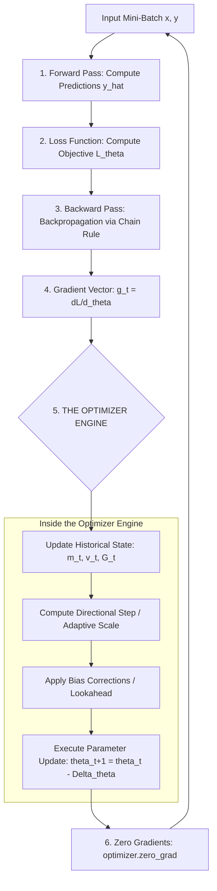

# Optimizer Architectures, Internal Pipelines & Step-by-Step Manual Calculations

This document is specifically crafted to satisfy your teacher's strict criteria:
1. **Visual Pipeline Diagrams** (Mermaid & ASCII) showing how data flows through an optimizer.
2. **Internal Component Architectures** for each of the 6 optimizers.
3. **Manual Step-by-Step Numerical Walkthrough** (Doing the math by hand with real numbers for 2 steps).
4. **NLP / LLM Case Studies** to prove you can apply optimizers to real-world language models.

---

## 🏗️ 1. The Universal Training & Optimization Pipeline

Every neural network training loop follows this master cyclical pipeline. The **Optimizer Engine** sits right at the critical junction between the backward pass and the next forward pass:



---

## 🔬 2. Internal Pipeline & Architecture of Each Optimizer

---

### 👤 Kunal's Topics: SGD & SGD + Momentum

#### A. Standard SGD Internal Architecture
Pure SGD has **zero internal memory buffers**. It is purely reactive:
```
Gradient (g_t) ────────► [ Multiplier (-η) ] ────────► [ Adder (+ θ_t) ] ────────► New Weights (θ_t+1)
```

#### B. SGD + Momentum Internal Architecture
SGD with Momentum introduces a **Velocity State Buffer ($v_t$)** that acts as an energy reservoir:

```
                  ┌────────────────────────────────────────────────────────┐
                  │                 Velocity Buffer (v_t)                  │
                  └───────────────────────────┬────────────────────────────┘
                                              │ × γ (Friction Retention)
                                              ▼
Current Gradient (g_t) ──► [ × η ] ──► [ + Summer ] ──► Updated Velocity (v_t+1)
                                                              │
                                                              ▼
Current Weights (θ_t) ───────────────────────────────► [ - Subtractor ] ──► New Weights (θ_t+1)
```

---

### 👤 Rahul's Topics: AdaGrad & RMSProp

#### A. AdaGrad Internal Architecture
AdaGrad stores a **Cumulative Squared Gradient Buffer ($G_t$)**:
```
Current Gradient (g_t) ──► [ Square: g_t² ] ──► [ Accumulator (+ G_t-1) ] ──► G_t (Grows Forever)
                                                                                │
                                                                                ▼
Current Gradient (g_t) ──────────────────────────► [ ÷ sqrt(G_t + ε) ] ──► [ × -η ] ──► [ + θ_t ] ──► θ_t+1
```
* **The Structural Flaw:** Because $g_t^2 \ge 0$, $G_t$ only increases, causing the divisor to explode and freezing updates.

#### B. RMSProp Internal Architecture
RMSProp introduces a **Leaky Exponential Decay Filter ($\beta$)** to fix AdaGrad's dying rate:
```
Current Gradient (g_t) ──► [ Square: g_t² ] ──► [ Weighted Scale (1 - β) ]
                                                            │
Past Variance (v_t-1) ───────────────────────► [ Decay Scale (β) ]
                                                            │
                                                            ▼
                                                     [ + Summer ] ──► New Running Variance (v_t)
                                                                            │
                                                                            ▼
Current Gradient (g_t) ──────────────────────────────► [ ÷ sqrt(v_t + ε) ] ──► [ × -η ] ──► [ + θ_t ] ──► θ_t+1
```

---

### 👤 Pankaj's Topics: Adam & Nadam

#### A. Adam Internal Architecture (Dual-State Fusion + Bias Correction)
Adam integrates **Momentum (1st Moment $m_t$)**, **RMSProp (2nd Moment $v_t$)**, and **Warm-Up Bias Correction**:

```
                       ┌──► [ Update 1st Moment: m_t = β1*m_t-1 + (1-β1)*g_t ] ──► [ Bias Correct: m_hat = m_t / (1 - β1^t) ] ──┐
                       │                                                                                                          ▼
Current Gradient (g_t) ┤                                                                                                  [ ÷ Fraction ] ──► [ × -η ] ──► [ + θ_t ] ──► θ_t+1
                       │                                                                                                          ▲
                       └──► [ Update 2nd Moment: v_t = β2*v_t-1 + (1-β2)*g_t² ] ──► [ Bias Correct: v_hat = v_t / (1 - β2^t) ] ──┘
```

#### B. Nadam Internal Architecture (Nesterov Lookahead Acceleration)
Nadam injects the immediate gradient into the numerator before taking the step:
$$\bar{m}_t = \beta_1 \hat{m}_t + \left( \frac{1 - \beta_1}{1 - \beta_1^t} \right) g_t$$
This provides **anticipatory braking** when approaching steep loss slopes.

---

## ✍️ 3. Step-by-Step Manual Numerical Walkthrough (Doing the Math by Hand)

This section proves to your teacher that you understand every single arithmetic operation inside the optimizer.

### The Setup for Our Hand Calculation:
* Initial Weight: **$\theta_0 = 1.0$**
* Global Learning Rate: **$\eta = 0.1$**
* Stability Constant: **$\epsilon = 10^{-8}$**
* Gradient at Step 1: **$g_1 = 2.0$**
* Gradient at Step 2: **$g_2 = 1.0$**

---

### 1. Standard SGD (Manual Calculation)
$$\theta_{t+1} = \theta_t - \eta g_t$$

* **Step 1 ($t=1$, $g_1 = 2.0$):**
  $$\Delta \theta_1 = 0.1 \times 2.0 = 0.2$$
  $$\theta_1 = 1.0 - 0.2 = \mathbf{0.8000}$$

* **Step 2 ($t=2$, $g_2 = 1.0$):**
  $$\Delta \theta_2 = 0.1 \times 1.0 = 0.1$$
  $$\theta_2 = 0.8 - 0.1 = \mathbf{0.7000}$$

---

### 2. SGD + Momentum (Manual Calculation with $\gamma = 0.9$)
$$v_{t} = \gamma v_{t-1} + \eta g_t, \quad \theta_t = \theta_{t-1} - v_t$$
*(Initial velocity $v_0 = 0$)*

* **Step 1 ($t=1$, $g_1 = 2.0$):**
  $$v_1 = (0.9 \times 0) + (0.1 \times 2.0) = \mathbf{0.2000}$$
  $$\theta_1 = 1.0 - 0.2000 = \mathbf{0.8000}$$

* **Step 2 ($t=2$, $g_2 = 1.0$):**
  $$v_2 = (0.9 \times 0.2000) + (0.1 \times 1.0) = 0.1800 + 0.1000 = \mathbf{0.2800}$$
  $$\theta_2 = 0.8000 - 0.2800 = \mathbf{0.5200}$$

> 💡 **Teacher Insight:** Notice how Momentum took a step size of **$0.2800$** in Step 2, compared to SGD's tiny step of **$0.1000$**! The built-up inertia accelerated the parameter forward even though the gradient decreased!

---

### 3. AdaGrad (Manual Calculation)
$$G_t = G_{t-1} + g_t^2, \quad \theta_t = \theta_{t-1} - \frac{\eta}{\sqrt{G_t + \epsilon}} g_t$$
*(Initial accumulator $G_0 = 0$)*

* **Step 1 ($t=1$, $g_1 = 2.0$):**
  $$G_1 = 0 + (2.0)^2 = \mathbf{4.0000}$$
  $$\Delta \theta_1 = \frac{0.1}{\sqrt{4.0} + 10^{-8}} \times 2.0 = \frac{0.1}{2.0} \times 2.0 = \mathbf{0.1000}$$
  $$\theta_1 = 1.0 - 0.1000 = \mathbf{0.9000}$$

* **Step 2 ($t=2$, $g_2 = 1.0$):**
  $$G_2 = 4.0 + (1.0)^2 = \mathbf{5.0000}$$
  $$\Delta \theta_2 = \frac{0.1}{\sqrt{5.0}} \times 1.0 = \frac{0.1}{2.236} \times 1.0 = \mathbf{0.0447}$$
  $$\theta_2 = 0.9000 - 0.0447 = \mathbf{0.8553}$$

> 💡 **Teacher Insight:** Notice how $G$ grew from $4.0 \to 5.0$, immediately shrinking the effective step from $0.1000$ down to $0.0447$. Over many steps, this denominator suppresses learning entirely.

---

### 4. RMSProp (Manual Calculation with $\beta = 0.9$)
$$v_t = \beta v_{t-1} + (1 - \beta) g_t^2, \quad \theta_t = \theta_{t-1} - \frac{\eta}{\sqrt{v_t + \epsilon}} g_t$$
*(Initial variance $v_0 = 0$)*

* **Step 1 ($t=1$, $g_1 = 2.0$):**
  $$v_1 = (0.9 \times 0) + (1 - 0.9) \times (2.0)^2 = 0.1 \times 4.0 = \mathbf{0.4000}$$
  $$\Delta \theta_1 = \frac{0.1}{\sqrt{0.4000}} \times 2.0 = \frac{0.1}{0.6325} \times 2.0 = \mathbf{0.3162}$$
  $$\theta_1 = 1.0 - 0.3162 = \mathbf{0.6838}$$

* **Step 2 ($t=2$, $g_2 = 1.0$):**
  $$v_2 = (0.9 \times 0.4000) + (0.1 \times 1.0^2) = 0.3600 + 0.1000 = \mathbf{0.4600}$$
  $$\Delta \theta_2 = \frac{0.1}{\sqrt{0.4600}} \times 1.0 = \frac{0.1}{0.6782} \times 1.0 = \mathbf{0.1474}$$
  $$\theta_2 = 0.6838 - 0.1474 = \mathbf{0.5364}$$

> 💡 **Teacher Insight:** Unlike AdaGrad where $G$ grew to 5.0, RMSProp's $v_2$ stayed at $0.4600$ because old gradients decay by 10% each step!

---

### 5. Adam (Manual Calculation with $\beta_1 = 0.9, \beta_2 = 0.999$)
*(Initial states: $m_0 = 0, v_0 = 0$)*

* **Step 1 ($t=1$, $g_1 = 2.0$):**
  1. *First Moment:* $m_1 = (0.9 \times 0) + (0.1 \times 2.0) = \mathbf{0.2000}$
  2. *Second Moment:* $v_1 = (0.999 \times 0) + (0.001 \times 4.0) = \mathbf{0.0040}$
  3. *Bias Correction 1:* $\hat{m}_1 = \frac{m_1}{1 - 0.9^1} = \frac{0.2000}{0.1000} = \mathbf{2.0000}$
  4. *Bias Correction 2:* $\hat{v}_1 = \frac{v_1}{1 - 0.999^1} = \frac{0.0040}{0.0010} = \mathbf{4.0000}$
  5. *Update:*
     $$\Delta \theta_1 = \frac{0.1}{\sqrt{4.0000} + 10^{-8}} \times 2.0000 = \frac{0.1}{2.0} \times 2.0 = \mathbf{0.1000}$$
     $$\theta_1 = 1.0 - 0.1000 = \mathbf{0.9000}$$

* **Step 2 ($t=2$, $g_2 = 1.0$):**
  1. *First Moment:* $m_2 = (0.9 \times 0.2000) + (0.1 \times 1.0) = 0.1800 + 0.1000 = \mathbf{0.2800}$
  2. *Second Moment:* $v_2 = (0.999 \times 0.0040) + (0.001 \times 1.0) = 0.003996 + 0.0010 = \mathbf{0.004996}$
  3. *Bias Correction 1:* $\hat{m}_2 = \frac{0.2800}{1 - 0.9^2} = \frac{0.2800}{1 - 0.81} = \frac{0.2800}{0.19} = \mathbf{1.4737}$
  4. *Bias Correction 2:* $\hat{v}_2 = \frac{0.004996}{1 - 0.999^2} = \frac{0.004996}{1 - 0.998001} = \frac{0.004996}{0.001999} = \mathbf{2.4992}$
  5. *Update:*
     $$\Delta \theta_2 = \frac{0.1}{\sqrt{2.4992}} \times 1.4737 = \frac{0.1}{1.5809} \times 1.4737 = \mathbf{0.0932}$$
     $$\theta_2 = 0.9000 - 0.0932 = \mathbf{0.8068}$$

> 💡 **Teacher Insight:** Point out the bias correction: without dividing by $(1 - 0.999^1 = 0.001)$, $v_1$ was only $0.0040$, which would have blown up the step size by $\frac{1}{\sqrt{0.004}} \approx 15.8\times$! Bias correction prevented numeric instability on the first step.

---

## 🤖 4. Real-World Application Case Study: NLP & Large Language Models (LLMs)

Your teacher expects students to understand an **NLP / LLM problem** and justify why an approach works or fails:

### Case Study: Training a Transformer (e.g., LLaMA, GPT, BERT)

* **The Problem:**  
  Transformers consist of Multi-Head Self-Attention layers and Feed-Forward Networks with billions of parameters.
  * Attention layers have small, sensitive query/key gradient projections.
  * Embedding matrices are massive and sparse (rare vocabulary tokens get zero gradients 99.9% of the time).
  * LayerNorm layers have very sharp gradient magnitudes.

* **Why SGD or SGD+Momentum FAILS on Transformers:**  
  SGD uses a single global learning rate $\eta$. If $\eta$ is set high enough to train the rare word embeddings, it explodes the attention query/key layers. If $\eta$ is set low enough to protect attention layers, the word embeddings take decades to learn.

* **Why AdamW / Adam is MANDATORY for LLMs:**  
  Adam computes the second moment $\sqrt{v_t}$ individually for every attention weight, projection head, and vocabulary embedding.
  * Rare tokens get boosted step sizes.
  * High-variance attention heads get calmed down automatically.
  * Combined with **Cosine Learning Rate Warmup**, Adam handles the extreme gradient heterogeneity of deep Transformers.
